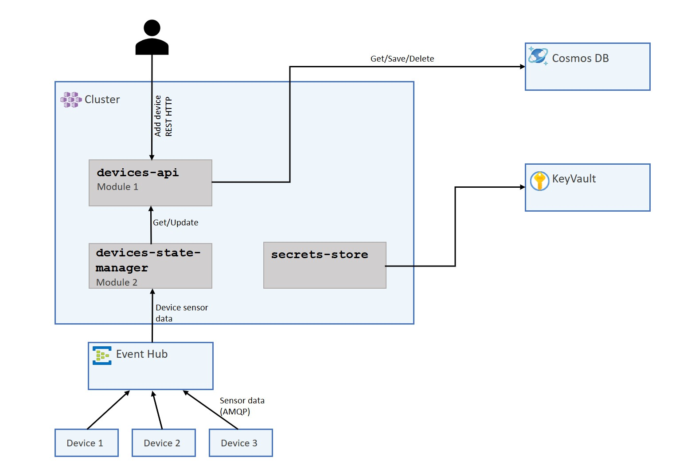

# 1. Provision Infrastructure

> 🎯 **Goal:** Provision the infrastructure for the workshop.

## 🏗️  Architecture

First, let's take a closer look at the application we'll be using for this workshop. It's a solution comprising two microservices, one written in C# and the other in Java, and a set of Azure resources. The solution allows users to onboard and manage simplistic smart-home devices in this case a temperature sensor. A simulator component will act as the sensor, generate the temperatures each device would measure and sends them to our small device management solution over EventHub.

While this solution is rather oversimple and not really a real-world example, its purpose is to provide you with hands-on experience in instrumenting various services written in different languages. This way, you'll become more comfortable with instrumenting your own solutions. Below, you'll find a diagram outlining our solution and the required resources.



## 🛠️ Provisioning

> **📌 Starting point 📌**
>
> Check out this branch to get started: [section/01-provision-infrastructure](https://github.com/observability-lab-cse/observability-lab/tree/section/01-provision-infrastructure)

Before we dive into the workshop, it's essential to have your Azure resources prepared. Think of this as laying the foundation for our upcoming steps.

To simplify this process for everyone, we have provided Bicep and Bash scripts that can create the entire infrastructure in one go.

Here's what you need to do:

1. Create a `.env` in the root of the project and add the following content to it.

    ```text
    ENV_RESOURCE_GROUP_NAME=
    ENV_LOCATION="westeurope"
    ENV_PROJECT_NAME= # should just be lowercase letters or numbers
    ```

2. Run the following command in the root of the repository

    ```sh
    az login
    az account set --subscription <name or ID of your subscription>

    make provision
    ```

3. Take a coffee break ☕️

When you return, your resources should be provisioned and ready to go 🚀.

> 📝 **Note:** If you are interested in how its deployed and all the Bicep scripts, here they all are: [/infrastructure](https://github.com/observability-lab-cse/observability-lab/tree/section/01-provision-infrastructure/infrastructure)

Running the script will provision the following essential resources for your application:

- 🌐  AKS (Azure Kubernetes Service): This is where your applications will be hosted.
- 🗄️ CosmosDB: This serves as your device registry.
- 🔒 KeyVault: A secure place to store your application secrets.
- 📨 EventHub: For real-time event streaming or in our case used to send and receive device temperature and health data.
- 💾 Storage Account: This component is essential for the secure storage of EventHub checkpoints.
- 📦 ACR (Azure Container Registry): To store the application container images.

Head to you Azure portal and make sure your resources are indeed provisioned. Fell free to have a small look around, before heading to the next chapter to deploy the solution on your AKS cluster.

## Navigation

[Previous Section ⏪](../00-pre-requisite/README.md) ‖ [Return to Main Index 🏠](../README.md) ‖
[Next Section ⏩️](../02-deploy-application/README.md)
