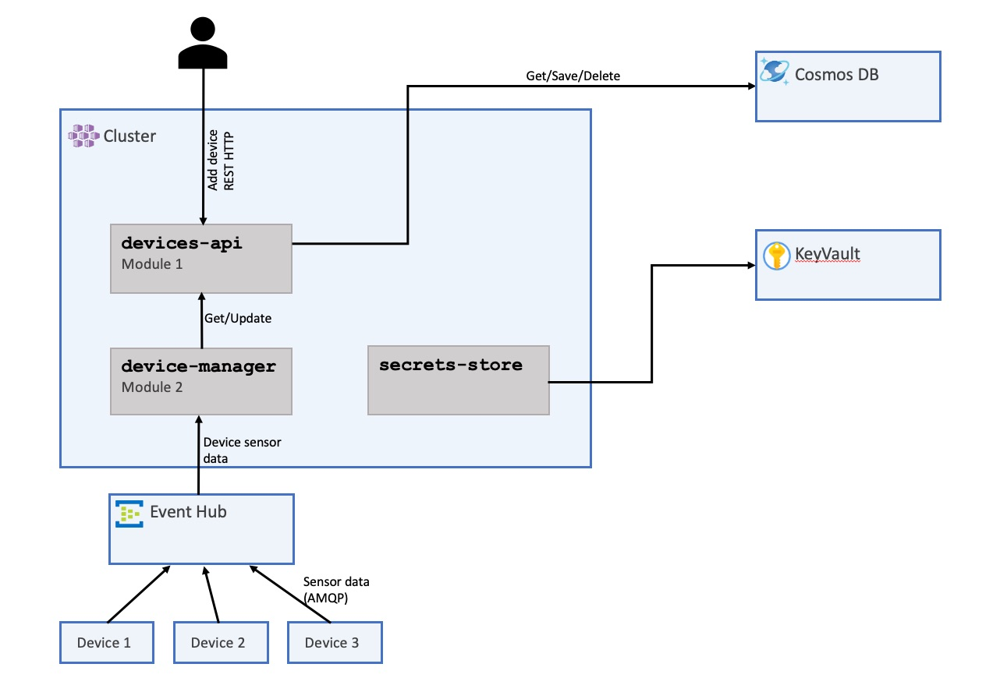

# Provision Infrastructure

> Goal: Achieving a fully operational infrastructure.

<!-- - Utilize Bash and Bicep scripts for infrastructure installation containing: AKS, AppInsighrs, Log Analyrtics workspace, etc.
- Quick run through of ech resource and its uses for the workshop -->

## 1. Architecture

First, let's take a closer look at the application we'll be using for this workshop. It's a XXXX solution comprising two microservices and a set of Azure resources. While this solution is rather simplistic and not a real-world example, its purpose is to provide you with hands-on experience in instrumenting various services written in different languages. This way, you'll become more comfortable with instrumenting your own solutions. Below, you'll find a diagram outlining our solution and the required resources



## 2. Provisioning

Before we dive into the workshop, it's essential to have your Azure resources prepared. Think of this as laying the foundation for our upcoming steps.

To simplify this process for everyone, we have provided Bicep and Bash scripts that can create the entire infrastructure in one go.

Here's what you need to do: Run the following command in the root of the repository, take a coffee break, and when you return, your resources should be provisioned and ready to go ☕️.

```sh
az login
az account set --subscription <name or ID of your subscription>

make provision
```

> Note: If you are interested in how its deployed and all the bicep scripts. Dont worry, here they all are: [/infra](https://github.com/observability-lab-cse/observability-lab/tree/section/01-provision-infrastructure/infrastructure)

Running the script will provision the following essential resources for your application:

- AKS (Azure Kubernetes Service): This is where your applications will be hosted.
- CosmosDB: This serves as your device registry.
- KeyVault: A secure place to store your application secrets.
- EventHub: For real-time event streaming or in our case used to send and receive device temperature and health data
- Storage Account: This component is essential for the secure storage of EventHub checkpoints
- ACR (Azure Container Registry): For the application conatiner images.
