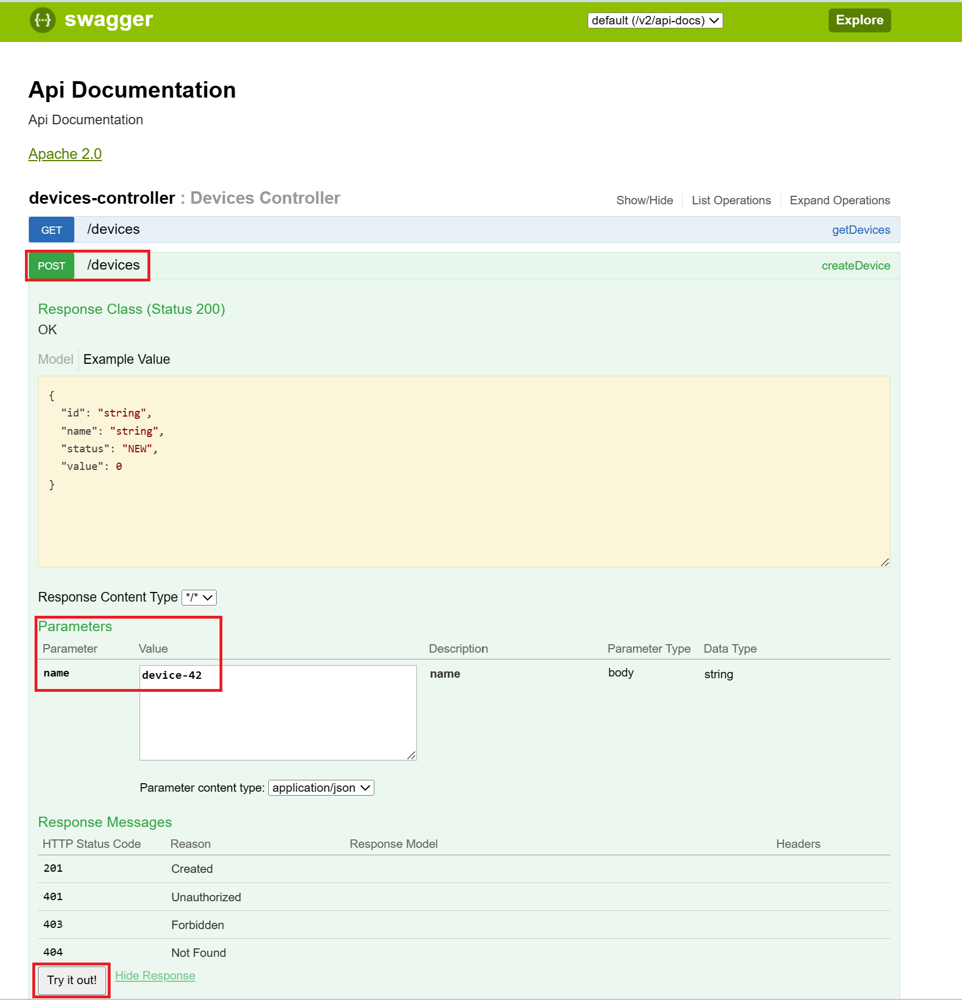
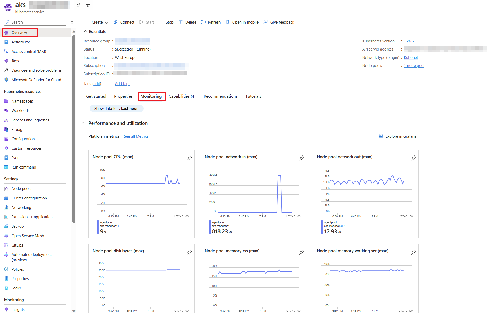
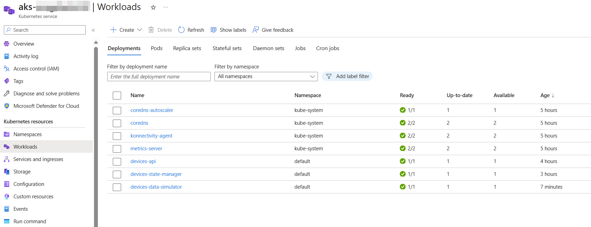
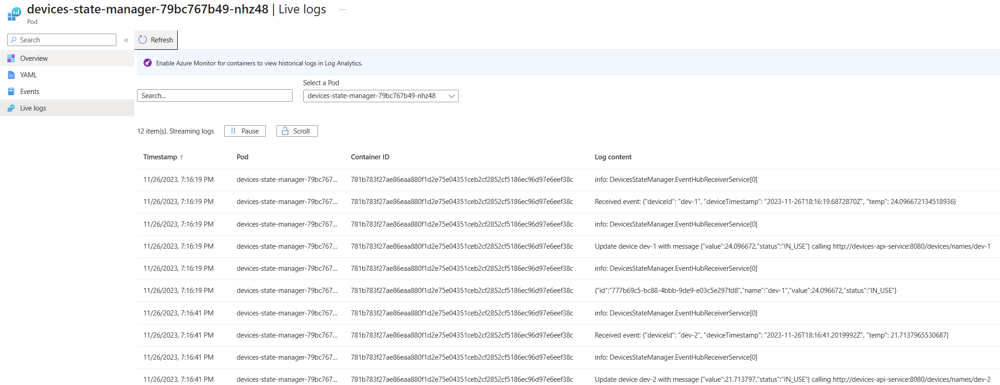

# 2. Deploying the applications into AKS

> 🎯 **Goal:**
>
> 1. Getting your applications up and running end-to-end and gaining an understanding of each component.
>
> 2. Being able to observe the running applications and getting familiar with out-of-the-box monitoring capabilities of the AKS cluster.

## 🚀  Deploy Application

> **📌 Starting point 📌**
>
> You need to provision your resources before you start with this section.
> In case you have not done the [previous section](../01-provision-infrastructure/README.md) get yourself up to speed by executing these steps:
>
> - Check out branch [section/02-deploy-application](https://github.com/observability-lab-cse/observability-lab/tree/section/02-deploy-application)
> - Copy .env.example file into .env and update the file with your values
> - Run `make provision`

Now, let's start deploying the individual services in our application. There are three components to our solution:

- 📱 **Devices API:** A Java application with an API that allows us to create, delete and list devices.
- ⚙️ **Devices State Manager:** This service is responsible for updating the state of devices stored within the Cosmos DB. For us, this reads the last published temperature values generated by the Devices Data Simulator and updates the device states.
- 🌡️ **Devices Data Simulator:** Simulates devices that publish their temperature over AMQP.

> 📝 **Note:**  Make sure you have sourced the `.env` file before you continue from here
>
> `source .env`

First we need to log into our Azure Container registry, so we can upload our docker images.

```sh
az acr login --name "acr$ENV_PROJECT_NAME".azurecr.io
```

### Deploy: 🔐 Secrets into AKS

Next, before deploying the application, we should set up all the secrets in the cluster with an easy command.

```sh
make deploy_secret_store
```

We will not go into more details on how to handle secrets in a K8s cluster, as this is not the main point of this workshop. But if you are interested, we leverage the Secret Store CSI driver to pull secrets from the Key Vault resource. You can read more about this here ["Use the Azure Key Vault provider for Secrets Store CSI Driver in an Azure Kubernetes Service (AKS) cluster"](https://learn.microsoft.com/en-us/azure/aks/csi-secrets-store-driver).

### Deploy: 📱 Devices API

Let's start by deploying the Devices API application. The code for this service can be found here [devices-api](https://github.com/observability-lab-cse/observability-lab/tree/section/02-deploy-application/sample-application/devices-api). It's a Java Spring Boot REST API that allows you to list, create, update, and delete devices from your device registry. Feel free to have a look at the code and check out what standard telemetry data is produced by the service before you go a head an deploy it 😉.

The first step is to build and push the image to the registry.

```sh
TAG="latest"
cd sample-application/devices-api

docker build -t "acr$ENV_PROJECT_NAME.azurecr.io/devices-api":"$TAG" .
docker push "acr$ENV_PROJECT_NAME.azurecr.io/devices-api":"$TAG"
```

Now, it’s time to deploy it to our Kubernetes cluster. The Bash script used to deploy your resources should have already connected you to your AKS cluster. You can double check this by running `kubectl config get-contexts`. In case your are not connected open the section below to see how to connect to it.

<details markdown="1">
<summary> Here’s how to connect to your AKS cluster:</summary>

```sh
AKS_NAME=$(az aks list -g "$ENV_RESOURCE_GROUP_NAME" --query "[0].name" -o tsv)
az aks get-credentials \
--resource-group "$ENV_RESOURCE_GROUP_NAME" \
--name "$AKS_NAME"
```

</details>

You’ll find the devices-api Kubernetes deployment manifest below or in the [k8s-files folder](https://github.com/observability-lab-cse/observability-lab/blob/section/02-deploy-application/k8s-files/devices-api-deployment.yaml).

Replace `${project-name}` with the value of your `$ENV_PROJECT_NAME` in your **devices-api-deployment.yaml** file. You can do this either manually or run the below command from the **root** folder:

```sh
sed -i "s/\${project-name}/$ENV_PROJECT_NAME/g" k8s-files/devices-api-deployment.yaml
```

Then, deploy it using the following command from the **root** repository folder:

```sh
kubectl apply -f k8s-files/devices-api-deployment.yaml
```

Let’s ensure that your Devices API is up and running smoothly. You can do this by using the `kubectl get pods` command. If everything is working as expected, this command should report that the `devices-api` pod is in the `Running` status.

<details markdown="1">
<summary> Click here for the Device API deployment YAML.</summary>

```yaml
kind: Deployment
apiVersion: apps/v1

metadata:
  name: devices-api

spec:
  replicas: 1
  selector:
    matchLabels:
      app: devices-api
  template:
    metadata:
      labels:
        app: devices-api
    spec:
      containers:
        - name: devices-api
          image: acr${project-name}.azurecr.io/devices-api:latest
          imagePullPolicy: Always
          ports:
            - containerPort: 8080
          resources:
            requests:
              cpu: 50m
              memory: 128Mi
            limits:
              cpu: 150m
              memory: 512Mi
          volumeMounts:
            - name: secrets-store-inline
              mountPath: "/mnt/secrets-store"
              readOnly: true
          env:
            - name: AZURE_COSMOS_DB_URI
              valueFrom:
                secretKeyRef:
                  name: application-secrets
                  key: CosmosDBEndpoint
            - name: AZURE_COSMOS_DB_KEY
              valueFrom:
                secretKeyRef:
                  name: application-secrets
                  key: CosmosDBKey
            - name: AZURE_COSMOS_DB_NAME
              valueFrom:
                secretKeyRef:
                  name: application-secrets
                  key: CosmosDBName
          readinessProbe:
            httpGet:
              path: /health
              port: 8080
            periodSeconds: 20
            initialDelaySeconds: 20
            failureThreshold: 15
      volumes:
        - name: secrets-store-inline
          csi:
            driver: secrets-store.csi.k8s.io
            readOnly: true
            volumeAttributes:
              secretProviderClass: "kvprovider"


---

apiVersion: v1
kind: Service
metadata:
  name: devices-api-service
spec:
  type: LoadBalancer
  ports:
  - port: 8080
    targetPort: 8080
  selector:
    app: devices-api

```

</details>

### Deploy: ⚙️ Devices State Manager

Next on our agenda is the deployment of the Devices State Manager service. You can access the source code for this service [here](https://github.com/observability-lab-cse/observability-lab/tree/section/02-deploy-application/sample-application/devices-state-manager/DevicesStateManager). This .NET application plays a critical role by updating the temperature records of devices in the database as data flows in from each device.

As with our previous steps, we'll need to build the image and ensure it's pushed to your Azure Container Registry (ACR).

```sh
TAG="latest"
cd sample-application/devices-state-manager/DevicesStateManager

docker build -t "acr$ENV_PROJECT_NAME.azurecr.io/devices-state-manager":"$TAG" .
docker push "acr$ENV_PROJECT_NAME.azurecr.io/devices-state-manager":"$TAG"
```

Just like we did for the devices-api, you’ll find the deployment manifest for the devices-state-manager in the same
[k8s-files folder](https://github.com/observability-lab-cse/observability-lab/blob/section/02-deploy-application/k8s-files/devices-state-manager-deployment.yaml) or below.
Same as previously, replace `${project-name}` with the value of your `$ENV_PROJECT_NAME` (manually or run the command below from **root** folder).

```bash
sed -i "s/\${project-name}/$ENV_PROJECT_NAME/g" k8s-files/devices-state-manager-deployment.yaml
```

Then, from the **root** repository folder, deploy it using the following command:

```sh
kubectl apply -f k8s-files/devices-state-manager-deployment.yaml
```

Let’s also make sure that your Devices State Manager is functioning properly. Run again `kubectl get pods` command and check that the `devices-state-manager` pod is in the `Running` status.

<details markdown="1">
<summary>Click here for the Devices State Manager deployment YAML.</summary>

```yaml
kind: Deployment
apiVersion: apps/v1

metadata:
  name: devices-state-manager

spec:
  replicas: 1
  selector:
    matchLabels:
      app: devices-state-manager
  template:
    metadata:
      labels:
        app: devices-state-manager
    spec:
      containers:
        - name: devices-state-manager
          image: acr${project-name}.azurecr.io/devices-state-manager:latest
          imagePullPolicy: Always
          ports:
            - containerPort: 8090
          resources:
            requests:
              cpu: 50m
              memory: 128Mi
            limits:
              cpu: 150m
              memory: 512Mi
          volumeMounts:
            - name: secrets-store-inline
              mountPath: "/mnt/secrets-store"
              readOnly: true
          env:
            - name: EVENT_HUB_CONNECTION_STRING
              valueFrom:
                secretKeyRef:
                  name: application-secrets
                  key: EventHubConnectionStringListen
            - name: EVENT_HUB_NAME
              valueFrom:
                secretKeyRef:
                  name: application-secrets
                  key: EventHubName
            - name: STORAGE_CONNECTION_STRING
              valueFrom:
                secretKeyRef:
                  name: application-secrets
                  key: StorageAccountConnectionString
            - name: BLOB_CONTAINER_NAME
              value: event-hub-data
            - name: DEVICE_API_URL
              value: "http://devices-api-service:8080"
      volumes:
        - name: secrets-store-inline
          csi:
            driver: secrets-store.csi.k8s.io
            readOnly: true
            volumeAttributes:
              secretProviderClass: "kvprovider"
---

apiVersion: v1
kind: Service
metadata:
  name: devices-state-manager-service
spec:
  type: LoadBalancer
  ports:
  - port: 8090
    targetPort: 8090
  selector:
    app: devices-state-manager

```

</details>

### Deploy: 🌡️ Devices Data Simulator

To generate data from virtual devices for testing purposes, we're deploying [the Device Simulator](https://learn.microsoft.com/en-us/samples/azure-samples/iot-telemetry-simulator/azure-iot-device-telemetry-simulator/). This simulator effectively generates temperature data at defined intervals for each virtual device and transmits this data as messages to Event Hub.

However, before we can start generating data, we need to create some devices in our device registry. To do this, we’ll use the Devices API.

<details markdown="1">
<summary> 🔍 Hint:  How to find the IP address of your Devices API.</summary>

```sh
kubectl get service devices-api-service -o jsonpath='{.status.loadBalancer.ingress[0].ip}'
```

</details>

Once you’ve located your Devices API, open your browser and navigate to: `<your_devices_api_ip>:8080`. This will open the Swagger UI for the Devices API. Locate `POST` endpoint, and create some devices.

<details markdown="1">
<summary> 🔍 Hint: How to create a device using the Swagger UI.</summary>



</details>

We’re now ready to bring our virtual devices to life by simulating data for them! You have two options to do this:

1. Use the provided YAML: Replace `DEVICE_NAMES_PLACEHOLDER` in [k8s-files/devices-data-simulator-deployment.yaml](https://github.com/observability-lab-cse/observability-lab/blob/section/02-deploy-application/k8s-files/devices-data-simulator-deployment.yaml) with your list of comma separated device names and then deploy using `kubectl apply -f k8s-files/devices-data-simulator-deployment.yaml`.
2. Use our handy bash script: This script automatically picks up your device names and deploys the simulator. You can run it with the following command:

```sh
make deploy-devices-data-simulator
```

> NOTE: Remember, any time you make changes to your list of devices (such as creating, deleting, or updating a device), you’ll need to update the list of device names in the simulator deployment. Alternatively, you can simply re-run the `make deploy-devices-data-simulator` command to keep everything in sync.

<details markdown="1">
<summary>Click here for the Devices Simulator deployment YAML.</summary>

```yaml
kind: Deployment
apiVersion: apps/v1

metadata:
  name: devices-data-simulator

spec:
  replicas: 1
  selector:
    matchLabels:
      app: devices-data-simulator
  template:
    metadata:
      labels:
        app: devices-data-simulator
    spec:
      containers:
        - name: devices-data-simulator
          image: mcr.microsoft.com/oss/azure-samples/azureiot-telemetrysimulator:latest
          imagePullPolicy: Always
          resources:
            limits:
              cpu: 500m
              memory: 256Mi
            requests:
              cpu: 100m
              memory: 128Mi
          env:
            - name: EventHubConnectionString
              valueFrom:
                secretKeyRef:
                  name: application-secrets
                  key: EventHubConnectionStringSend
            - name: DeviceList
              value: "DEVICE_NAMES_PLACEHOLDER" # Specify your device names with formate `<device-1>,<device-2>,..,<device-n>`
            - name: MessageCount
              value: "0" # send unlimited
            - name: Interval
              value: "60000" # each device sends message every 1 minute
            - name: Template
              value: '{"deviceId": "$.DeviceId", "deviceTimestamp": "$.Time", "temp": $.DoubleValue}'
            - name: Variables
              value: '[{"name": "DoubleValue", "randomDouble":true, "min":20.00, "max":28.00}]'
```

</details>

## 📦 Out of the box observability

Let’s embark on a journey of discovery and see what Azure AKS has to offer right out of the box! Head over to the Azure Portal and navigate to your AKS cluster. Try to find out:

- AKS level metrics. These are the vital signs of your AKS, providing valuable insights into its performance.
- An overview of your pods and services. This is where you’ll see the heart of your operations.
- Live logs. While they don’t maintain a history, they offer a real-time glimpse into your system’s activities.

If you’re finding it a bit challenging, don’t worry! Here are some screenshots to guide you:

<details markdown="1">
<summary>Click here to see the AKS metrics overview.</summary>



</details>

<details markdown="1">
<summary>Click here to see the AKS workloads overview.</summary>



</details>

<details markdown="1">
<summary>Click here to see the AKS Live Logs.</summary>



</details>

Now this looks all good and great. There is an awesome overview of our cluster, but other than the logs (in a, let's be honest, rather unpratical format), we have no real visibility on the applications. No way to know if messages are being sent across the system, etc.
But luckily there is a simple way to fix this, which we will look at in the next chapter.

## Navigation

[Previous Section ⏪](../01-provision-infrastructure/README.md) ‖ [Return to Main Index 🏠](../README.md) ‖
[Next Section ⏩️](../03-add-basic-observability-instrumentation/README.md)
