# Visualization

> Goal: Gain knowledge of available out-of-the-box visualizations in Azure and learn how to use it effectively to get insights about your applications.

You’ve done a great job collecting telemetry data from your applications, but that's only half of the story. Now you need to see what your data can tell you about your application's performance, reliability, and user experience. 🕵️‍♂️

Azure has a lot of awesome visualizations that you can use to investigate your data in depth. In this section we will have a look what is available out-of-the-box.

## Platform metrics visualizations

Let's start from the observability pillar that is the easieast to visualize - metrics.

Metrics are numerical values that measure various aspects, such as performance, reliability, and usage. They can help you identify and troubleshoot issues and optimize your resources.

You can find them in the Overview section of most Azure services. For example, let’s take a look at Event Hub. Go to your Event Hub Overview page and you’ll see some charts showing metrics like incoming and outgoing messages, bytes, and errors.

<details markdown="1">
<summary>Click here to see what the Event Hub Overview metrics should look like in your Azure Portal.</summary>

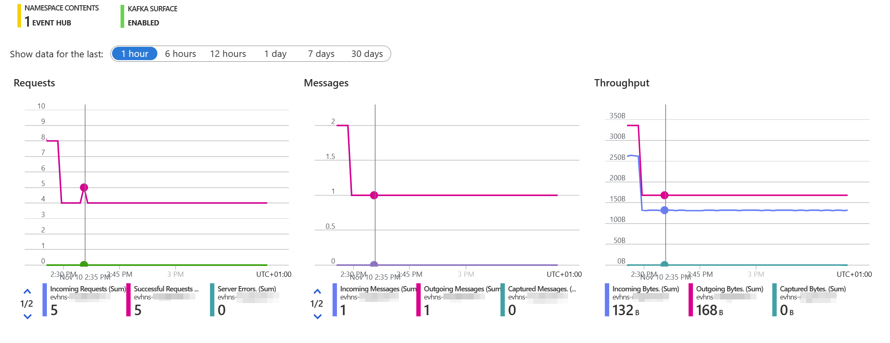

</details>

You can click on any of these charts to go to the Metrics section, where you can customize them to your liking. You can choose different metrics, aggregations, filters, and chart types. You can also remove any metrics that you don’t need.

<details markdown="1">
<summary>Click here to see a selected Event Hub metric chart.</summary>

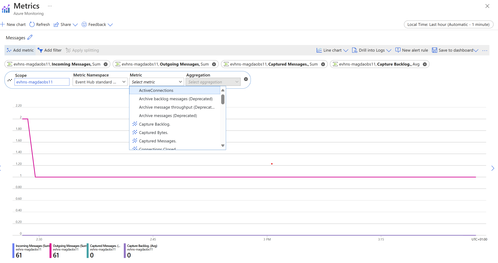

</details>

Let’s see if you can answer some questions based on the Event Hub metrics:

1. How many incoming and outgoing messages do you have every 5 minutes?
1. How many incoming and outgoing bytes do you have per minute?
1. Are there any Event Hub errors?

Try to create your own metric charts to find the answers. You can use the hints below if you get stuck.

Hints:

* To change the time window or granularity, click on the selected time in the right upper corner and select your Time range or Time granularity.
* To add or remove metrics, click on the Add metric button and select or deselect the metrics you want.
* To change the chart type, click on the Line chart button and select Area, Bar, or Scatter.


## Curated visualizations - Insights

You’ve already mastered Azure’s built-in metric charts to visualize your data, but did you know there’s more to it? Now, let’s play a little guessing game. Can you guess where the telemetry data from OpenTelemetry auto-instrumentation lands? 🤔

If you guessed Application Insights, you’re absolutely right! 🎉 Azure’s Application Insights is not just a service, it’s your personal observability wizard. It offers a curated monitoring experience with different views for various aspects of your application, such as failures, performance, availability, and more. Let’s dive into it and see what we can learn. 🚀

Navigate to your Application Insights Overview page and check available metrics charts. 

<details markdown="1">
<summary>Click here to see what the Application Insights Overview metrics should look like in your Azure Portal.</summary>

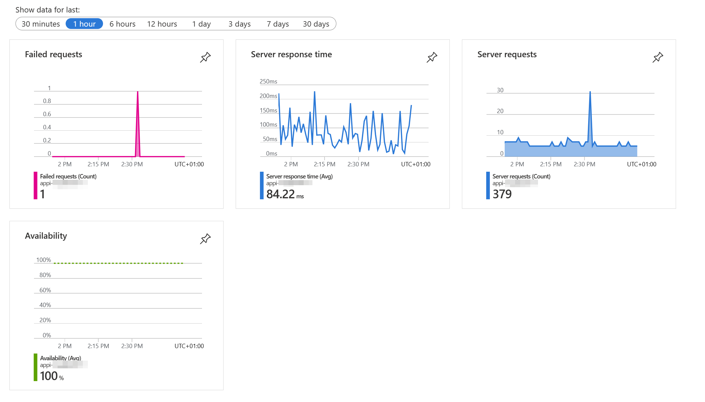

</details>

Clicking on the charts in Application Insights offers a different experience compared to the Event Hub. In the Event Hub, clicking on a metric chart in the Overview page takes you to the Metrics page. However, in Application Insights, when you click on any of these charts, you’re taken to the *Investigate* section. 🕵️‍♂️🔍

For example, if you click on the *Failed requests* chart, you’ll be directed to the *Investigate Failures* view. This isn’t just a page with metrics, it’s an interactive section where you can delve deeper into your data and make sense out of metrics, logs and traces. So go ahead, click on a chart, and start exploring.

<details markdown="1">
<summary>Click here to see the Application Insights Failures view.</summary>

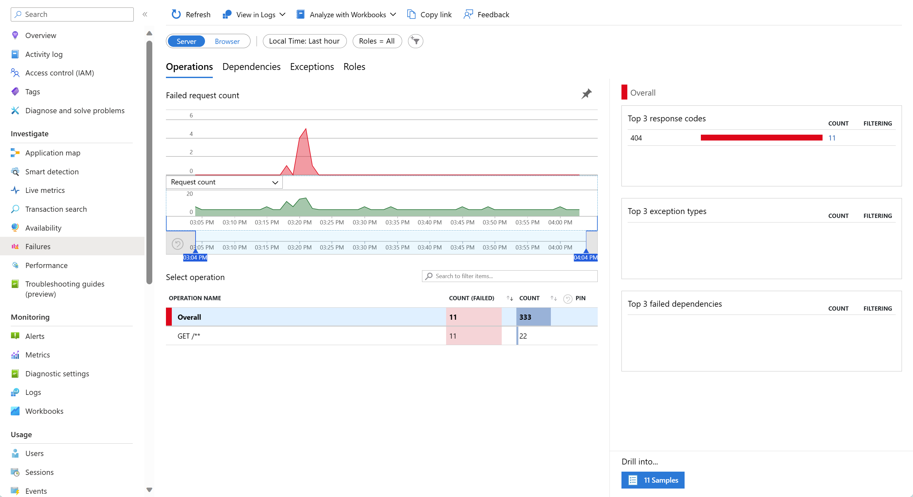

</details>

If you click on the Server response time or Server requests chart, you'll go to the *Investigate Performance* view.

<details markdown="1">
<summary>Click here to see the Application Insights Performance view.</summary>

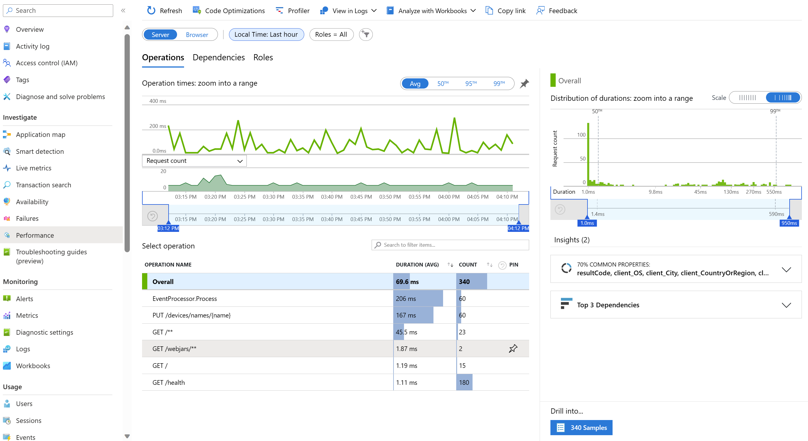

</details>


The last chart shows Availability, but it won't show any data unless you set it up first. Let's do that now.

Click on the Availability chart and you'll go to the *Investigate Availability* view.

<details markdown="1">
<summary>Click here to see what the Application Insights Availability view should look like in your Azure Portal.</summary>

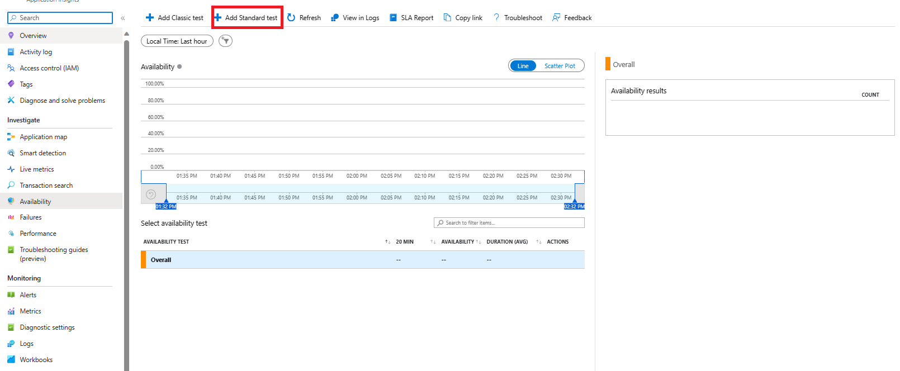

</details>

[Application Insights availability tests](https://learn.microsoft.com/en-us/azure/azure-monitor/app/availability-overview) are great for monitoring availability and responsiveness of any HTTP or HTTPS endpoint. Our devices-api and devices-state-manager expose `health` endpoints, so we can use them to set up availability tests. Find out what the `health` endpoint of the devices-api and devices-state-manager is and create [a Standard test](https://learn.microsoft.com/en-us/azure/azure-monitor/app/availability-standard-tests). 

<details markdown="1">
> How to find your application IP?
>
> ```shell
> DEVICES_API_IP=$(kubectl get service devices-api-service -o jsonpath='{.status.loadBalancer.ingress[0].ip}')
> HEALTHCHECK_URL="http://$DEVICES_API_IP:8080/health"
> ```

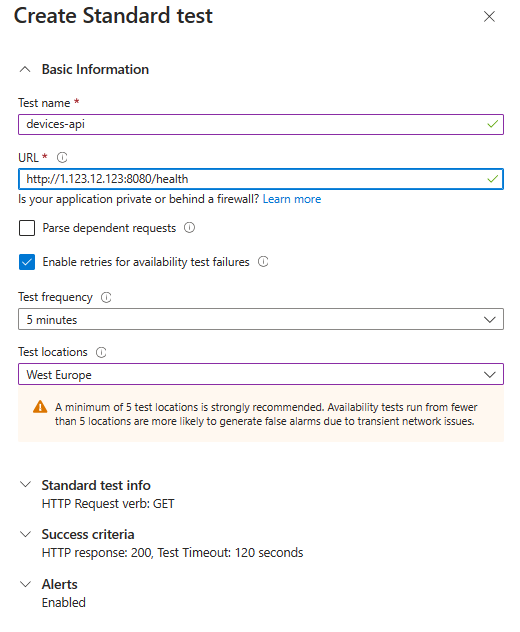

</details>

After some time, you should be able to see your availability results. Based on the data, find out:

1. What is the average request duration per each location, and across all locations?
1. What was the exact duration of the GET /health request in one of your selected locations?

<details markdown="1">
<summary>Click here to find the answer to the first question.</summary>

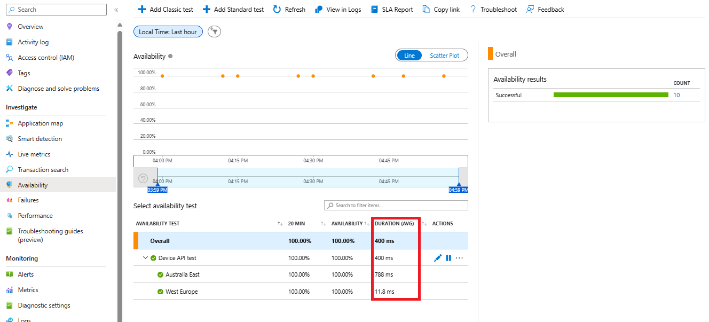

</details>


<details markdown="1">
<summary>Click here to find the answer to the second question.</summary>

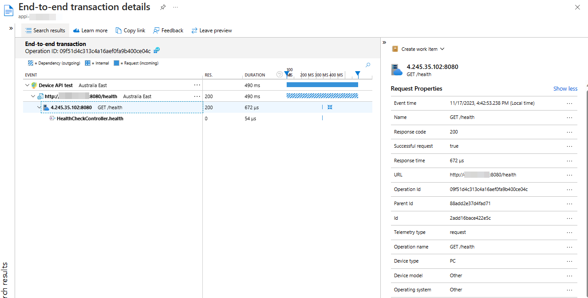

</details>

Under the Investigate section, you'll find more views that you can explore. Go through them, especially check the Application map. It shows you how your application components are connected and how they perform. 

<details markdown="1">
<summary>Click here to see the Application Map.</summary>

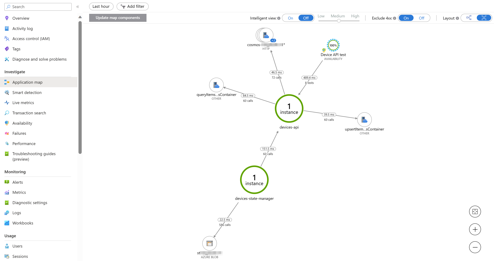

</details>

Under the Monitoring section, you'll find Workbooks. They are interactive reports that you can use to analyze your data in various ways. There are many of them, so you don't have to go through all of them, but at least check:

* Downtime & Outages
* Failures Analysis
* Performance Analysis

And on top of that, there is a great overview dashboard that gives you a quick glance at your application's health and performance.


<details markdown="1">
<summary>Click here to view where the dashboard button is located.</summary>

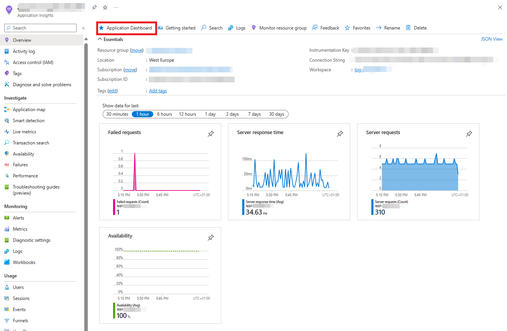

</details>

<details markdown="1">
<summary>Click here to view what the dashboard should look like in your Azure Portal.</summary>

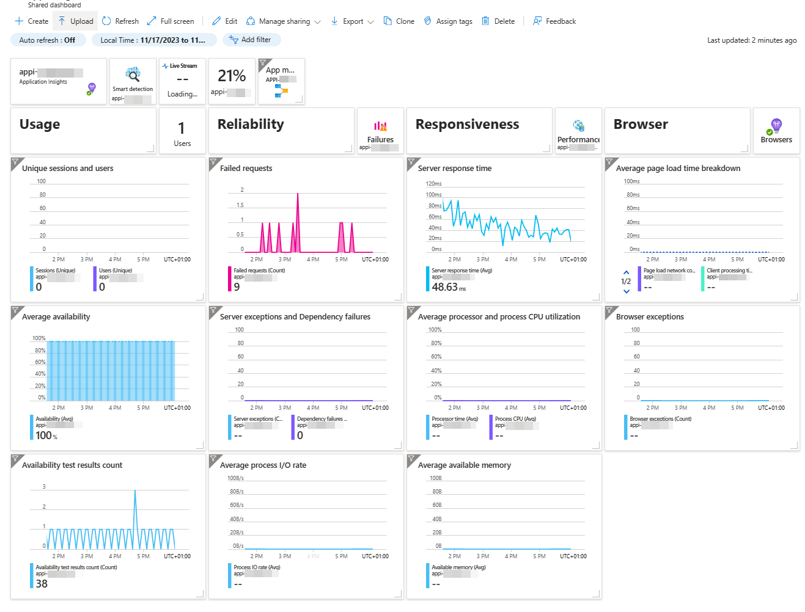

</details>

Now that you’ve gained this knowledge, it’s time to apply it. Can you answer these questions?

1. Can you identify the slowest performed operation?
1. How many `PUT` requests were performed in the last hour, and what is the 99th percentile duration of these requests?
1. A dependency is a component that's called by your application. Can you find out what the dependencies of devices-api and devices-state-manager are?
1. Which dependency component is called most frequently, and how many times was it called in the last 30 minutes?
1. Can you pinpoint the slowest dependency call?
1. What are the response codes of failed requests, and can you determine why they failed?
1. How many dependency calls failed, and can you figure out why?


## Additional metrics coming from OpenTelemetry auto-instrumentation

That's already a lot of insights, but wait, there's more! OpenTelemetry auto-instrumentation for .NET and Java provides a bunch of useful metrics that can be found under the custom metric namespace `azure.applicationinsights`. These metrics can give you more insights into your application's performance, such as memory usage, CPU usage, GC count, etc.

To view these metrics, go to the Monitoring Metrics section in Application Insights, and then select `azure.applicationinsights` as the Metric Namespace.

<details markdown="1">
<summary>Click here to see where to find custom metrics.</summary>

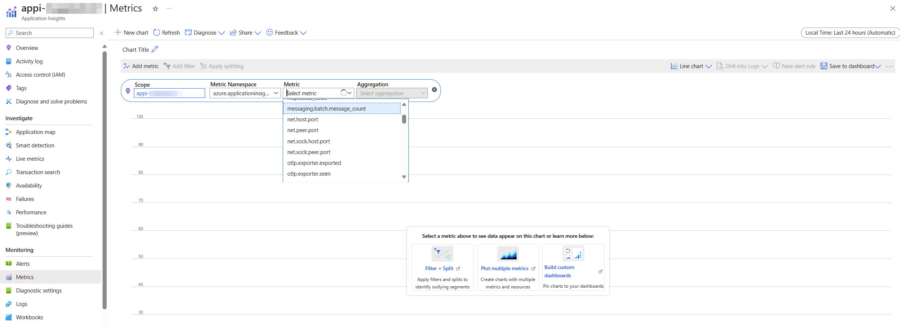

</details>

Based on these metrics, find out:

1. What is the memory usage for the devices-api application?
1. What is the memory usage for the devices-state-manager application?

Optional: 

There is also another way to query these metrics. These metrics are so-called log-based metrics, which means they are stored in the Log Analytics workspace in the `customMetrics` table. This way, you can access more details about the metrics, such as the custom dimensions.

<details markdown="1">
<summary>Click here to see where to find custom metrics as logs</summary>

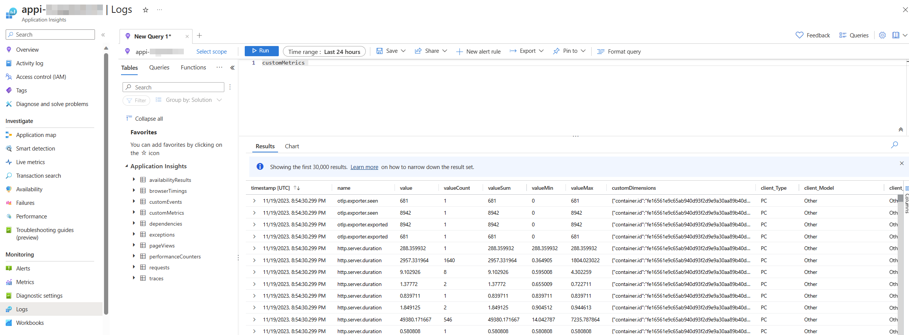

</details>

Try to find the same metrics as you used in the previous excercise, and check what additional information is provided when looking at metrics in this view.

Tip: review in details `customDimensions`.

## View logs

We’ve delved into metrics, traced the paths of our data, but there’s one aspect we haven’t touched upon yet - the logs of our application.

In Azure Monitor, these logs can be accessed through Application Insights or Log Analytics workspace, but let's use the first one.

To view your logs, navigate to Application Insights for your application, and select Logs from the left-hand menu. You can find your logs under the `traces` table.

<details markdown="1">
<summary>Click here to see where to find logs</summary>

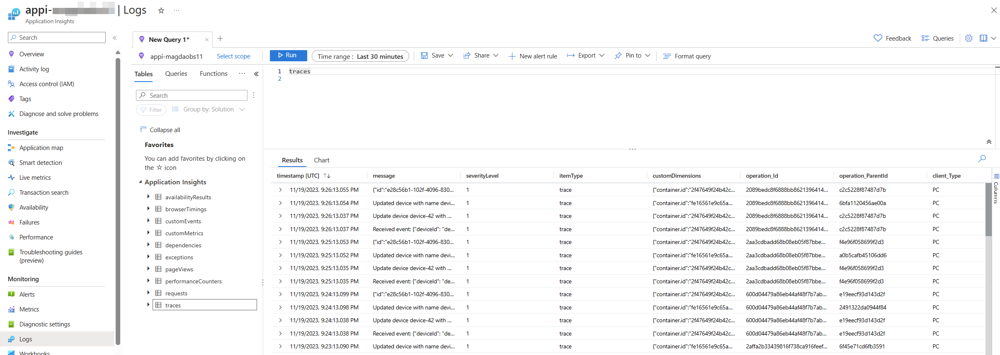

</details>

You’ll see a query editor where you can write and run queries using the Kusto Query Language (KQL). KQL is a language that lets you manipulate and transform your data in various ways. We’ll dive deeper into the ocean of KQL in the upcoming chapter, but for now, let’s get our feet wet.

Take a moment to acquaint yourself with the structure of your data. Can you trace the origins of various log entries? Can you identify which application they hail from? Put on your detective hat and start connecting the dots!


## Navigation

[Previous Section ⏪](../03-add-basic-observability-instrumentation/) ‖ [Return to Main Index 🏠](../README.md) ‖
[Next Section ⏩️](../05-alert/README.md)
