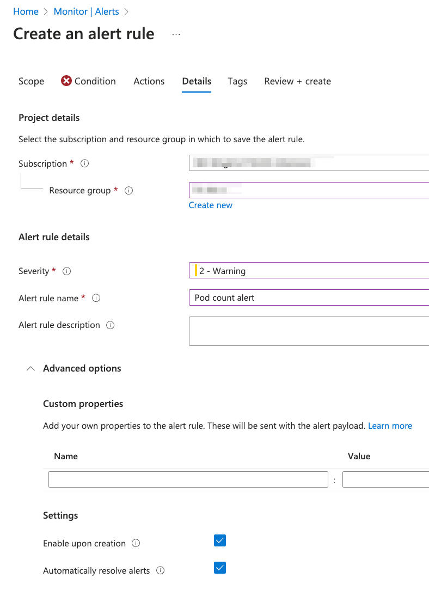
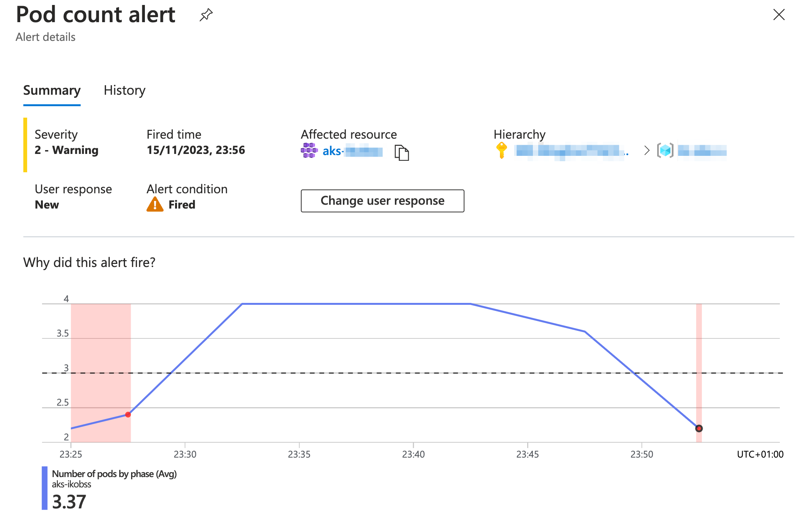
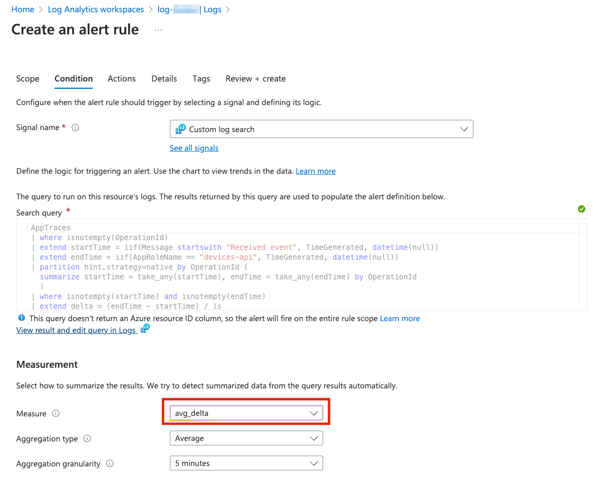

# 6. Alerts 🔔

> 🎯 **Goal:**  Gain a basic understanding of alerts on Azure.

Do you want to be the first to know when your apps and infra are acting up? Do you want to get ahead of the problems before they ruin your day (or night)? If you answered yes to any of these questions, then this workshop section is for you!

## 🧐 Why do we need alerts?

In a nutshell, alerts can help you identify 🔍 and troubleshoot issues 🙀 before they affect your users or customers. They can also help you to align your observability goals with your business objectives, such as customer satisfaction, revenue, and growth.

## 📚 Intro


Alerts are stored for 30 days. You can see all alert instances for all of your Azure resources on the Alerts page in the Azure portal.

Alerts consist of a few elements, presented in the next sections.

## 🛠️ Step-by-step

> **📌 Starting point 📌**
>
> In case you have not completed the previous sections:
>
> - Check out this branch: [section/06-alert](https://github.com/observability-lab-cse/observability-lab/tree/section/06-alert)
> - Copy .env.example file into .env and update the file with your values
> - Run `make` from the root folder.

### Action groups

**Action groups** - Collection of notification preferences defined by the user. You can configure an Action Group to notify you through one or more of these collections when an alert is triggered. This allows you to respond quickly and effectively to issues in your environment.

Each action group is given a unique name and can be used by both Azure Monitor and Service Health alerts. An action group can be used across different subscriptions, allowing you to manage your alert actions centrally.

Let's [create an Action Group](https://learn.microsoft.com/en-us/azure/azure-monitor/alerts/action-groups) for Email notification ✉️!

1. Navigate to the Monitor tab.
2. Under Monitor, select Alerts.
3. Click on "Action groups".
  
4. Click on "+ Create" to create a new Action Group.
  

> 📝 **Note:**  Action Groups can not only be configured to send **Notifications** but also to perform various **Actions** when an alert is triggered. These actions include: Azure Functions, Logic App, Webhook, Event Hubs etc. But for this exercise we can skip defining Actions. 😉

> 📝 **Note:** You can test your Action Group Notification by going to **Action Groups** section in **Alerts** and using **Test** button.Try it out and check if you get a test email 📧!

### 🚨 Alert conditions

Alerts are based on certain conditions that you define. Each resource has its own set of conditions.

Let's create an **Alert Condition**. Feel free to create your own if you want. Here, we will go with an alert condition about AKS pods - let's set up an email notification if the number of pod in the pod lifecycle is less than 3 (or 4 if you have 4 pods deployed).


In the Actions tab pick the **Action Group** that you created previously.



> 📝 **Note:**  You can set up if the alert should be resolved automatically. If we uncheck that then the user needs to manually resolve the alert.

Now let's test our alert. We need to delete one of our pods.

```sh
kubectl get deployment
```

You should see the output:

```sh
NAME                     READY   UP-TO-DATE   AVAILABLE   AGE
devices-api              1/1     1            1           3h
devices-state-manager    1/1     1            1           3h
opentelemetrycollector   1/1     1            1           3h1m
```

Grab the name of one of the deployments

```sh
kubectl remove deployment devices-state-manager
```

And now wait until you get your alert email.

> 📝 **Note:**  Don't forget to redeploy the deleted service! To do so you can now just use the `make deploy` command from the project root folder

### 👷 User response

User response is a feature that allows you to manually set the status of an alert.

Now you should get your email and see the alert in the Alerts window. If you click on the fired alert you can see more details.

One thing you can do is change the User response. Let's change it to **Acknowledged** as we noticed the alert.



Once the condition changes and the alert is no longer valid (we deployed missing pods) then the Alert changes his status to **Resolved**:


### 🔩 Alert processing rules

Alert processing rules allow you to apply processing on fired alerts. Alert processing rules are different from alert rules. Alert rules generate new alerts, while alert processing rules modify the fired alerts as they're being fired.

For example, you can use Alert processing rules to temporarily disable all action groups for Alerts for specific resource (e.g. during planned maintenance).

Another example would be to set up a specific action group for all Alerts in your resource with a Critical severity, for instance if you want to notify the support team immediately when critical alert occurs.

> 📝 **Note:**  Alerts can be stateless and stateful.
>
> - **Stateless alerts** fire each time the condition is met, even if fired previously.
> - **Stateful alerts** fire when the rule conditions are met, and will not fire again or trigger any more actions until the conditions are resolved.
>

<details markdown="1">
<summary> 🔦 What kind of alert is the one we just created?</summary>

Stateful! [Metric Alerts are stateful](https://learn.microsoft.com/en-us/azure/azure-monitor/alerts/alerts-metric-logs#overview) - only notifying once when alert is fired and once when alert is resolved; as opposed to Log alerts, which are stateless and keep firing at every interval if the alert condition is met.

</details>

## 📔 Log based alerts

In the [previous step](#-alert-conditions) we have created a metric alert rule using one of the predefined alerts for AKS. Let's take a look now how we can create alerts based on the logs.

In the [Custom Dashboards](../05-dashboards) section you have created the dashboard showing different metrics. One of them was **Average processing time for last 10min**. Let's create an alert based on it!

Go to Application Insights and the Section Logs on the left pane. Don't close the existing pop up right away! There are many predefined alert logs that can be useful in your application. Feel free to review them.  

We are going to create an alert based on a custom log. Feel free to go to your dashboard and grab the log from it or just copy it from below:

```kql
 AppTraces
 | where isnotempty(OperationId)
 | extend startTime = iif(Message startswith "Received event", TimeGenerated, datetime(null))
 | extend endTime = iif(AppRoleName == "devices-api", TimeGenerated, datetime(null))
 | partition hint.strategy=native by OperationId (
   summarize startTime = take_any(startTime), endTime = take_any(endTime) by OperationId
   )
 | where isnotempty(startTime) and isnotempty(endTime) 
 | extend delta = (endTime - startTime) / 1s
 | project startTime, delta
 | summarize avg(delta) by bin(startTime,10m)
 | sort by startTime desc
 | take 1
```

Now go ahead and click **+New Alert Rule** and create the alert using the Alert Action Group created above.



You can **View result and edit query in Logs** and run your query:


For the learning purposes modify the processing time threshold so that the alert is triggered.

After it's done, create a few devices using swagger, then run your simulator and observe the alerts!

Go to `http://DEVICES_IP:8080/swagger-ui.html` and create a few new devices (don't worry if you forgot how to do it, [Section 2: Deploy 🌡️ Devices Data Simulator](../02-deploy-application/README.md#deploy---devices-state-manager) you can find instructions how to do it).

```sh
# run simulator
make deploy-devices-data-simulator 
```

## 🚧 Built-in alerts

Let's review first the built-in alerts in Azure Portal. It's useful to check them out as they may be useful for your solution.

Virtual Machines, AKS and Log Analytics workspaces support [Alert rule recommendation feature](https://learn.microsoft.com/en-gb/azure/azure-monitor/alerts/alerts-manage-alert-rules#enable-recommended-alert-rules-in-the-azure-portal). After enabling it you can use predefined Alert rules and combine them with your Action groups.


### 🧠 Smart detection alerts

[Smart detection](https://learn.microsoft.com/en-us/azure/azure-monitor/alerts/proactive-diagnostics) performs proactive analysis of the telemetry that your app sends to Application Insights. If there’s a sudden rise in failure rates or abnormal patterns in client or server performance, you get an alert. This feature is enabled by default and operates if your application sends enough telemetry.

To look at Smart detection rules go to Application Insights -> Smart Detection.

In Alerts view you should see also alert rules created by Smart Detector:


## 🩺 Service Health alerts

What's [Azure Service Health](https://learn.microsoft.com/en-gb/azure/service-health/overview)?

The portal provides you with a customizable dashboard which tracks the health of your Azure services in the regions where you use them.
In this dashboard, you can track active events like ongoing service issues, upcoming planned maintenance, or relevant health advisories.
When events become inactive, they get placed in your health history for up to 90 days.
Service health notifications are stored in the [Azure activity log](https://learn.microsoft.com/en-gb/azure/azure-monitor/essentials/platform-logs-overview).
You can use them to create **your own alerts**. E.g. you can create an alert that gets triggered when one of the services in your subscription is down.
The alerts can be also integrated with external alerting tools, like PagerDuty.

## ⚖️ Resource Health Alerts

Azure Service Health provides you also with a section called Resource Health, which keeps you informed about health of your Azure resources.
Same as Service health notifications, Resource health notifications are stored in the Azure activity log. And they also can be used to create alerts!

Find Azure Service Health in Azure portal and pause here for a moment to explore the differences between Service and Resource Health Alerts.

## Exercise 💪

We went through a few ways how to create the alerts. Imagine that you need to create an alert that is triggered when your devices-api application is not healthy.

How would you do that? Discuss with others and try out your ideas.

>🔍 Hint:  If you want to test your alert and "make your application" unhealthy you can remove the deployment from kubernetes or modify the healthcheck code to return 500 and redeploy.

<details markdown="1">
<summary>🔦 Reveal the ideas!</summary>

Some ideas (there are probably even more options to do it):

- [Resources Health alert](https://learn.microsoft.com/en-us/azure/service-health/resource-health-alert-monitor-guide)
- [Alerts for Specific Exceptions with Application Insights](https://stackoverflow.com/questions/47147651/creating-alerts-for-specific-exceptions-with-application-insight-microsoft-azur)
- [Container insights log alert](https://learn.microsoft.com/en-us/azure/azure-monitor/containers/container-insights-log-alerts)
- [Availability Alerts with Application Insights](https://learn.microsoft.com/en-us/azure/azure-monitor/app/availability-alerts)

</details>

<details markdown="1">
<summary>👑 Recommended solution</summary>

One of the [best practices](https://learn.microsoft.com/en-us/azure/azure-monitor/best-practices-alerts#configuration-recommendations) for alerts
is to set up Resource Health alert rules.
Resource Health alerts can notify you in near real-time when these resources have a change in their health status.

Please note also that Resource Health alerts are [free of charge](https://learn.microsoft.com/en-us/azure/azure-monitor/best-practices-alerts#cost-optimization) (same as service health alerts).

Go ahead and [create a Resource Alert](https://learn.microsoft.com/en-us/azure/service-health/resource-health-alert-monitor-guide) in Azure Portal.

</details>

<details markdown="1">
<summary>💭 Another solution</summary>

Let's now take a closer look at the last idea - Availability Standard test alert!

Go to Application Insights -> Availability section.

If you did the steps from [Section 4: Visualisation](../04-visualization/README.md#-curated-visualizations---insights) you should have the Availability Standard test for devices-api health-check created there already.

If you didn't, just create a standard test posting an endpoint to your application health check as shown below:

> How to find your application IP?

```sh
DEVICES_API_IP=$(kubectl get service devices-api-service -o jsonpath='{.status.loadBalancer.ingress[0].ip}')
HEALTHCHECK_URL="http://$DEVICES_API_IP:8080/health"
```


The Alert Rule will be automatically created for you!


</details>

## [Optional] Infrastructure as Code

If you need to create custom alerts in your infrastructure you can add Azure Monitor alerts in Bicep by following these steps:

1. Design an Azure Alert Rule in the Azure Portal.

2. Export your Alert Rule as an ARM template: When the rule has been defined, you can go to “Alert Rules” in Azure Monitor, click on your new rule, then "Export template". From there, you can easily export your Alert Rule as an ARM template.

3. Convert an ARM alert rule to Bicep: You can convert the newly exported JSON template into Bicep. When the conversion is done, you can make any modifications as you see fit in the code and commit them to your code repository. Here’s the quick recap of how to convert a JSON file to Bicep with the Bicep CLI:

   `az bicep decompile -f theARMfile.json`

   In Bicep, you can create log alerts with the type [`Microsoft.Insights/scheduledQueryRules`](https://learn.microsoft.com/en-us/azure/azure-resource-manager/bicep/scenarios-monitoring). The created bicep file should create one resource of that type.

4. Modify the Bicep File: When you have converted the ARM template into a Bicep file, you should make any necessary modifications for your specific situation, e.g. add meaningful names.

5. You can put your alert e.g. in log_analytics.bicep file.

6. For simplicity don't specify any Action Groups (they can be added using [`Microsoft.Insights/actionGroup`](https://learn.microsoft.com/en-us/azure/templates/microsoft.insights/actiongroups) resource type).

7. Deploy the Bicep File: Then you’re ready to deploy it.
  
Move your custom alert from previous section to bicep.

## Navigation

[Previous Section ⏪](../05-dashboards/README.md) ‖ [Return to Main Index 🏠](../README.md) ‖
[Next Section ⏩️](../07-custom-metrics/README.md)
