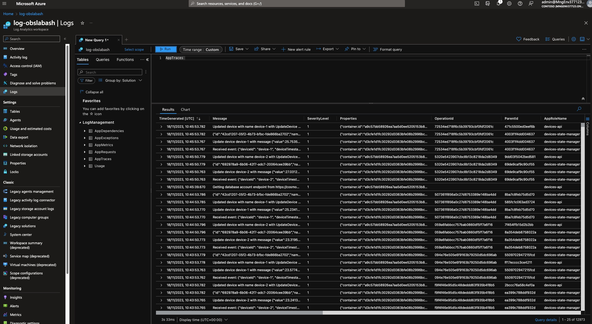
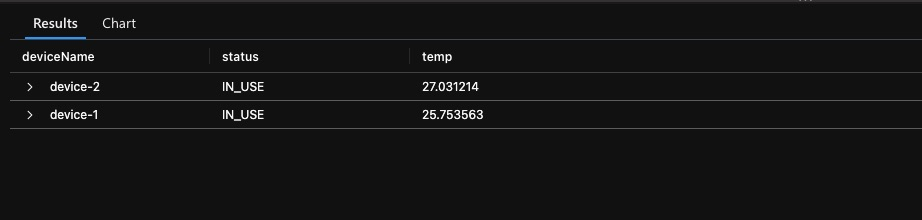
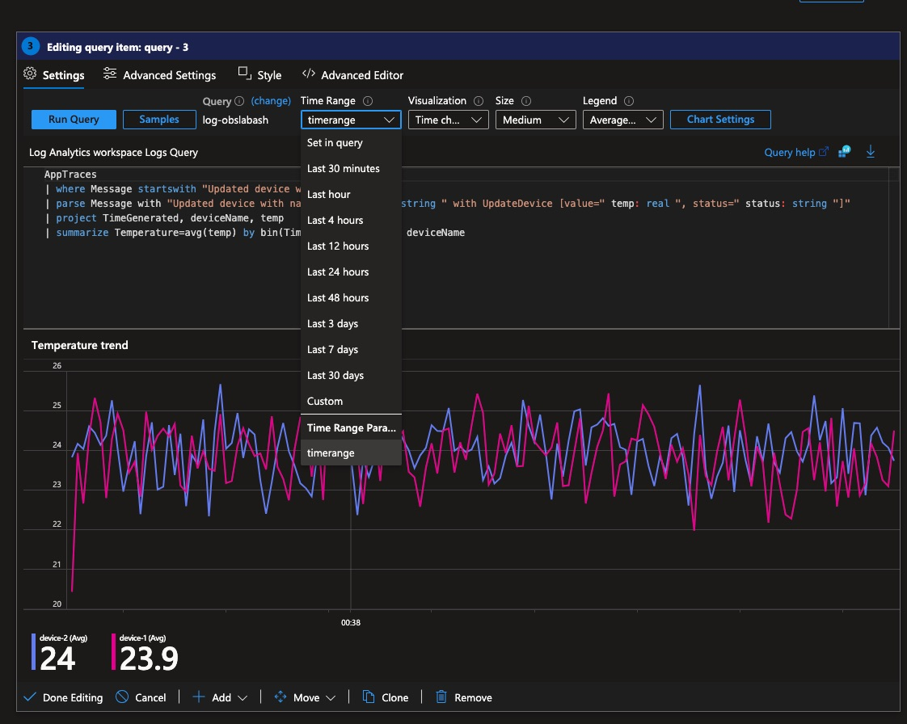
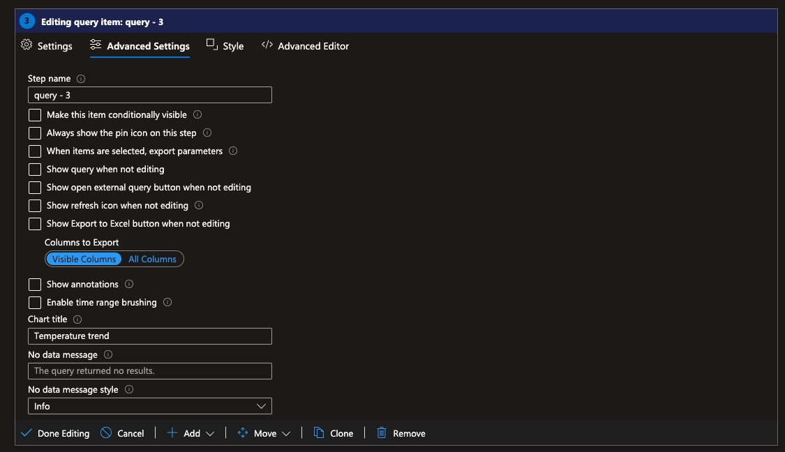
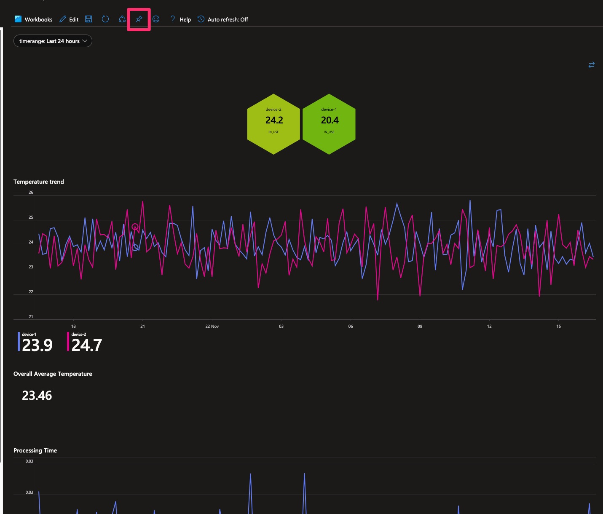
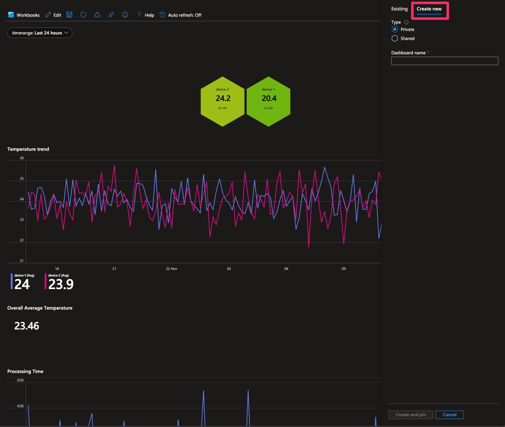
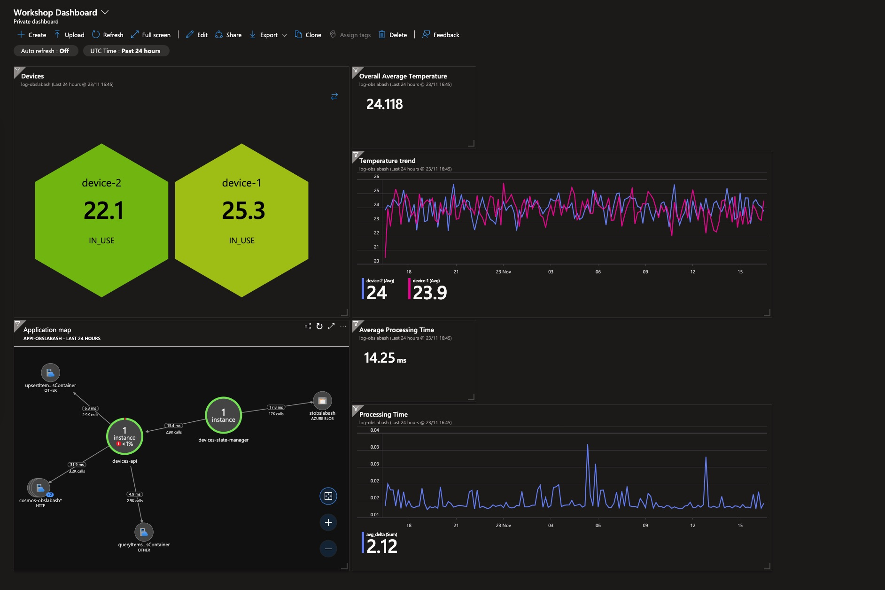

# 6. Custom Dashboards

> 🎯 **Goal:** Play around with KQL and learn how to create custom dashboards.

<details markdown="1">
<summary> <b> ⏩ Catch-up corner: If you missed previous sections 🏇</b></summary>

If you have not completed previous sections, follow these steps:
- Check out this branch [`section/06-dashboards`](https://github.com/observability-lab-cse/observability-lab/tree/section/06-dashboards).
- Copy the `.env.example` file into a new file named `.env`, and update this new file with your values.
- Run the command `make` from the root repository folder.

To trigger sending messages in your system follow the instructions from [Section 2: Deploy: 🌡️ Devices Data Simulator](../02-deploy-application/README.md#deploy---devices-data-simulator)

</details>


As you saw previously, there are a lot of out-of-the-box dashboards that visualize things. But what if we don't have things visualized as we want? What if we want a birds-eye view on some metrics, visualization and graphs that are custom to us?

Don't worry; there's also a way for that.

Let's take our solution as an example. What would you like to know at first glance?

- We'd like to know the temperature of each of our devices, their names, and status.
- How has the temperature changed over time? What is the average temperature over the past 10 minutes?
- How long does our solution take to update new device data?
- How stale is the last device update?

So let's look at this step by step.

Firstly, we need to locate the information to display. In other words, find our base telemetry data and potentially a suitable KQL queries.
Secondly, we need to visualize these queries somehow on a dashboard. 📊✨

## 📈 How to get the data we need

Let's walk through one of the examples: "We would like to actually know the temperature of each of our devices, their names, and status."

This example is a bit special, and we could approach it in two ways:

- Option 1. **Accessing the Cosmos DB:** We can access the information stored in there.
- Option 2. **Using Telemetry Data:** Utilizing the telemetry data we already have to collect this information.

For now, let's proceed with option 2.

> 📝 **Note:** Some might ask, "But what about devices that have not sent any telemetry data yet?" or "Shouldn't the Cosmos DB be the ground truth for this?" Yes, both are valid points. Option 2 is not the recommended choice for this scenario. However, for the sake of practicing Kusto and avoiding deploying two new resources just for learning purposes, we acknowledge that this solution will (hopefully) never see the light of day in production. So, let's make all our lives easier and proceed with option 2 for now! 😄

As you saw in the previous chapter, all telemetry generated by OpenTelemetry auto-instrumentation can be found in either our Application Insights or Log Analytics workspace resource.

Let's go over to the Log Analytics workspace resource and take a look at how to access logs of these resources.
Navigate to your Log Analytics workspace and select the `Logs` tab. If you navigate to `AppTraces` under `LogManagement` and run the query, you should see the list of the most recent incoming log statements.

> 💡 **Kusto Tip 1:** Double-click tables to automatically fill them into your query window.

> 💡 **Kusto Tip 2:** You can select a subset of your query to run, similar to some SQL editors.



If you inspect the `Message` column, you should be able to see that the `devices-api` application logs two statements when it runs.

It logs something like:

- `{"id":"692978a9-6b06-42f7-adc7-20064cee39bb","name":"device-2","value":27.031214,"status":"IN_USE"}`

  or

- `Updated device with name device-1 with UpdateDevice [value=25.753563, status=IN_USE]`

Since we're not concerned about the ID for now, let's focus on the log line that begins with `Update device...`. This line contains all the necessary data for us to answer our original question: _What is the status, temperature, and name of the devices_.

Now, let's attempt to create a table that resembles the one below with the latest temperature and status data for your devices.



How you get there is up to you! If you need help or hints, open the dropdown for a list of Kusto operators that might come in handy.

> 💡 **Kusto Tip 3:** Try filtering out as many rows of data as possible before performing more complex operators to reduce runtime.

<details markdown="1">
<summary> 🔍 Hint: Operators to use</summary>

Here are some operators:

- [parse](https://learn.microsoft.com/en-us/azure/data-explorer/kusto/query/parseoperator)
- [where](https://learn.microsoft.com/en-us/azure/data-explorer/kusto/query/whereoperator)
- [summarize](https://learn.microsoft.com/en-us/azure/data-explorer/kusto/query/summarizeoperator)
- [project](https://learn.microsoft.com/en-us/azure/data-explorer/kusto/query/projectoperator)

</details>

<details markdown="1">
<summary> 🛠️ Step-by-Step guide for this query</summary>

### Step-by-step

If you are, however, unfamiliar with Kusto and already feel lost, not to worry! Open the section below to get a step-by-step guide through this and some additional help.

Else, welcome to the step-by-step guide into your first Kusto query!

So, key things you need to know about a KQL query:

1. Your query should start with a table or dataset.
2. Your operations are separated by a pipe `|`.
3. If you use variables in the query editor, ensure there are no empty lines, and all variable assignments end with a semicolon `;`.

Following these three steps, you should be mostly good, although the query editor is known for cryptic error messages.

Now let's start with the actual query.

#### 1. Prepare data

First, we would like to extend our existing data table with three new columns: `temp`, `status`, and `deviceName`. This can be achieved by using the `parse` operator.

```kql
AppTraces
| parse Message with "Updated device with name " deviceName: string " with UpdateDevice [value=" temp: real ", status=" status: string "]"
```

Some of you might now realize that this might not be the most effective way to do this and could cause a lot of empty fields in the three new columns. By adding a filter before parsing, we can ensure that only the rows we care about are parsed.

```kql
AppTraces
| where Message startswith "Updated device with name"
| parse Message with "Updated device with name " deviceName: string " with UpdateDevice [value=" temp: real ", status=" status: string "]"
```

> Kusto Tip 4: When filtering, you have multiple options, e.g., `startswith`, `contains`, `has`, etc. Some are more efficient than others, especially for large data. Check this handy guide on how to optimize your query: [Best practices for Kusto Query Language queries](https://learn.microsoft.com/en-us/azure/data-explorer/kusto/query/best-practices)

#### 2. Get latest temperature value for each device

Now that we have each temperature change in our resulting table, we only care about the latest for each device. To achieve this, KQL has a handy operator called `summarize`. It allows you to aggregate your input given an aggregation function by group expressions.

In our case, we want to aggregate the latest values for each device name we have. Using the `arg_max(TimeGenerated,*)` aggregation function and selecting `deviceName` as our group expression:

```kql
AppTraces
| where Message startswith "Updated device with name"
| parse Message with "Updated device with name " deviceName: string " with UpdateDevice [value=" temp: real ", status=" status: string "]"
| summarize arg_max(TimeGenerated, *) by deviceName
```

#### 3. Clean up

We're nearly there! Our table looks rather cluttered with information we don't really care about. To clean this up, you can use the `project` operator and define the columns we want to keep.
Add the below line to your query and you are done.

```kql
| project deviceName, status, temp
```

</details>

<details markdown="1">
<summary> 🔦 Possible solution query</summary>

```kql
AppTraces
| where Message startswith "Updated device with name"
| parse Message with "Updated device with name " deviceName: string " with UpdateDevice [value=" temp: real ", status=" status: string "]"
| summarize arg_max(TimeGenerated, *) by deviceName
| project deviceName, status, temp
```

</details>

## ✨ How to make it look nice

Now, if you want to spice it up a little , consider this: a table is boring and not visually appealing.
 But wait, how about a honeycomb diagram 🍯? Intriguing, right?
If yes, head to the Workbook tab of your Log Analytics workspace and create a new workbook. This workbook will allow you to create much nicer graphs. You can explore all the beautiful options [here](https://learn.microsoft.com/en-us/azure/azure-monitor/visualize/workbooks-visualizations) 🎨.

For instance, try visualizing the table into a honeycomb diagram by following the instructions detailed in [honeycomb visualizations](https://learn.microsoft.com/en-us/azure/azure-monitor/visualize/workbooks-honey-comb) 🐝.


Another advantage of having these queries in a workbook is that:

1. 🗄️ They are stored somewhere and easily accessible by people.
2. 📌 They can be pinned on Azure dashboards.

Let's add a few more queries to this dashboard so you have more content to use when we crate a dashboard later on.

**Query: How has the temperature changed over time, and what is the average temperature over the past 10 minutes?**

<details markdown="1">
<summary> 🔍 Hint: Operators to use</summary>

Here are some operations:

- [parse](https://learn.microsoft.com/en-us/azure/data-explorer/kusto/query/parseoperator)
- [where](https://learn.microsoft.com/en-us/azure/data-explorer/kusto/query/whereoperator)
- [summarize](https://learn.microsoft.com/en-us/azure/data-explorer/kusto/query/summarizeoperator)
- [project](https://learn.microsoft.com/en-us/azure/data-explorer/kusto/query/projectoperator)
- [sort](https://learn.microsoft.com/en-us/azure/data-explorer/kusto/query/sort-operator) -[take](https://learn.microsoft.com/en-us/azure/data-explorer/kusto/query/takeoperator)

</details>

<details markdown="1">
<summary> 🔦 Possible solution query</summary>

```kql
AppTraces
| where Message startswith "Updated device with name"
| parse Message with "Updated device with name " deviceName: string " with UpdateDevice [value=" temp: real ", status=" status: string "]"
| project TimeGenerated, deviceName, temp
| summarize Temperature=avg(temp) by bin(TimeGenerated, 10m), deviceName
```

```kql
AppTraces
| where Message startswith "Updated device with name"
| parse Message with "Updated device with name " deviceName: string " with UpdateDevice [value=" temp: real ", status=" status: string "]"
| project TimeGenerated, deviceName, temp
| summarize Temperature=avg(temp) by bin(TimeGenerated, 10m)
| sort by TimeGenerated desc
| take 1
```

</details>

**Query: How long does it take for our solution to update the new device data and, what is the average processing time over the past 10 minutes?**

This might be a bit more challenging as it involves a sub-query. Give it a try!

<details markdown="1">
<summary> 🔍 Hint: Operators to use</summary>

Here are some operators:

- [parse](https://learn.microsoft.com/en-us/azure/data-explorer/kusto/query/parseoperator)
- [where](https://learn.microsoft.com/en-us/azure/data-explorer/kusto/query/whereoperator)
- [summarize](https://learn.microsoft.com/en-us/azure/data-explorer/kusto/query/summarizeoperator)
- [project](https://learn.microsoft.com/en-us/azure/data-explorer/kusto/query/projectoperator)
- [sort](https://learn.microsoft.com/en-us/azure/data-explorer/kusto/query/sort-operator)
- [take](https://learn.microsoft.com/en-us/azure/data-explorer/kusto/query/takeoperator)
- [partition](https://learn.microsoft.com/en-us/azure/data-explorer/kusto/query/partitionoperator)
- [extend](https://learn.microsoft.com/en-us/azure/data-explorer/kusto/query/extendoperator)

</details>

<details markdown="1">
<summary>🔦 Possible solution query</summary>

```kql
AppTraces
| where isnotempty(OperationId)
| extend startTime = iif(Message startswith "Received event", TimeGenerated, datetime(null))
| extend endTime = iif(AppRoleName == "devices-api", TimeGenerated, datetime(null))
| partition hint.strategy=native by OperationId (
    summarize startTime = take_any(startTime), endTime = take_any(endTime) by OperationId
    )
| where isnotempty(startTime) and isnotempty(endTime)
| extend delta = (endTime - startTime) / 1s
| project startTime, delta
| summarize avg(delta) by bin(startTime,10m)
| render timechart
```

```kql
AppTraces
| where isnotempty(OperationId)
| extend startTime = iif(Message startswith "Received event", TimeGenerated, datetime(null))
| extend endTime = iif(AppRoleName == "devices-api", TimeGenerated, datetime(null))
| partition hint.strategy=native by OperationId (
    summarize startTime = take_any(startTime), endTime = take_any(endTime) by OperationId
    )
| where isnotempty(startTime) and isnotempty(endTime)
| extend delta = (endTime - startTime) / 1s
| project startTime, delta
| summarize avg(delta) by bin(startTime,10m)
| sort by startTime desc
| take 1
```

</details>

### Export to Dashboard

Now that we've crafted these beautiful graphs and visualizations, let's go a step further and create a dashboard for a comprehensive bird's-eye view of our solution.

Before we can seamlessly export the diagrams into an Azure dashboard, there are some preliminary steps to ensure a smooth experience.

1. Setup a Time Range Picker

    In order to manipulate the time range displaying the time-series data in the dashboards, we need to add a parameter to the workbook. Follow these [instructions for Workbook time parameters](https://learn.microsoft.com/en-us/azure/azure-monitor/visualize/workbooks-time). After completing these instructions, double-check that all your queries properly use the time picker you've created.

    <details markdown="1">
    <summary>Set Time Range to parameter</summary>

    

    </details>

2. Set Diagram Titles

    By default, when you pin queries from a workbook, the title will be the workbook name. To avoid having to change titles every time you pin diagrams into a dashboard, let's add them to the workbook.

    You can do this by navigating to the advanced sections.

    <details markdown="1">
    <summary>Set Title</summary>

    

    </details>

Now, proceed to the top of your workbook and select "Pin All" or you can pin each individually.

<details markdown="1">
<summary>Pin Workbook Items</summary>



</details>

Then select `Create new` and choose your dashboard name.

<details markdown="1">
<summary>Create Dashboard</summary>



</details>

Once you've completed that, proceed to search for dashboards and select your newly created ones. Ideally, they should contain all your new plots.

Your next step is to rearrange the graphs to suit your preferences and organize them as needed.



And just like that you have your final dashboard! 🥳

Head to the next section to learn how to set up alerts so you will always know if something is going wrong 📟

## Navigation

[Previous Section ⏪](../05-visualization/README.md) ‖ [Return to Main Index 🏠](../README.md) ‖
[Next Section ⏩️](../07-alert/README.md)
