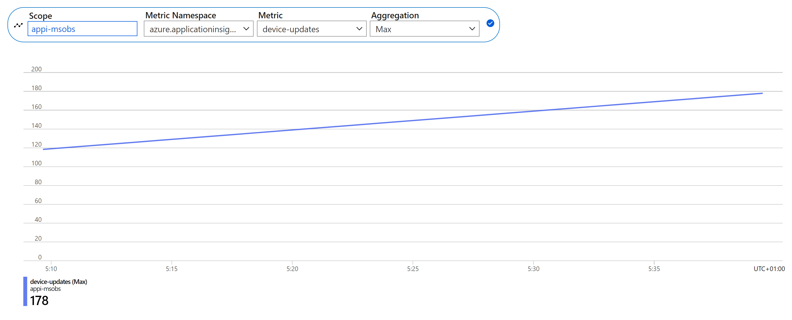
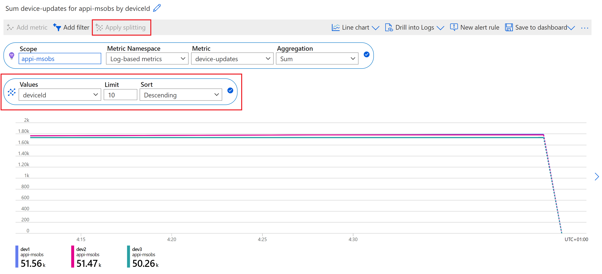
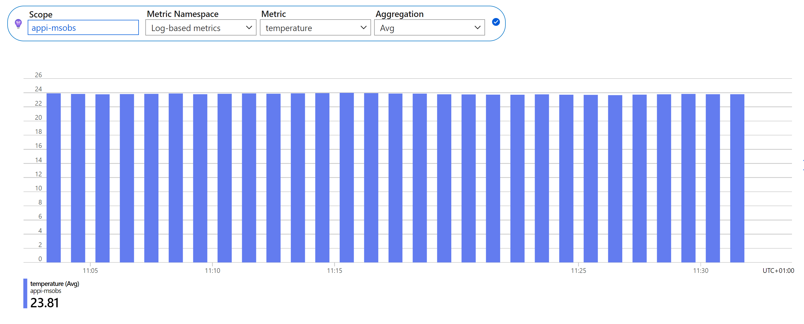
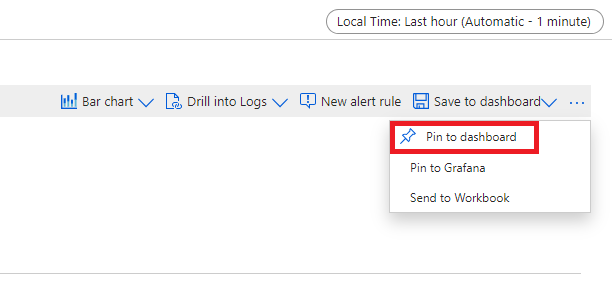
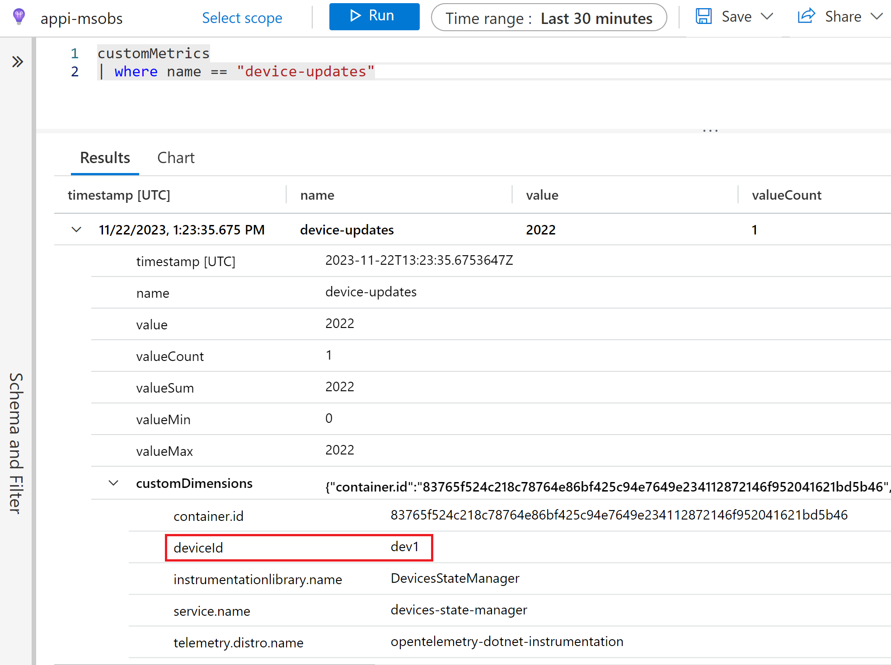
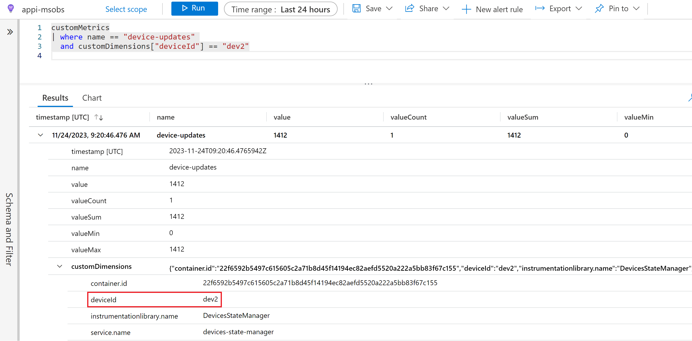

# 7. Custom metrics

> 🎯 **Goal:** Gain insights into how to add custom metrics to an application and visualize them in Application Insights.

## Intro

Custom metrics, also called user-defined or application-specific metrics, allow us to define and collect information about our system that the standard built-in metrics cannot track.
This will typically be metrics related to the business logic of our application, allowing us to measure the impact of events happening in the system on the user experience or the business.
In this section you will learn how to add custom metrics to our applications and find out how to visualize them in Application Insights. 🕵️‍♂️

## 🛠️ Step-by-step

> **📌 Starting point 📌**
>
> In case you have not completed the previous section, check out this branch: [/instrumented-app](https://github.com/observability-lab-cse/observability-lab/tree/instrumented-app), and run `make` from the root folder.

### Adding custom metrics

Given our business logic, where devices periodically send temperature measurements, it would be useful to know how many device updates occurred in a specific time window. This will be our device update counter metric which we will define in the `devices-state-manager` application that handles all device state and temperature changes.

The basic observability instrumentation with OpenTelemetry gives us a good starting point to add custom metrics to our application in just a few minutes.

First, we need to add a new .NET package to the `devices-state-manager` application: `System.Diagnostics.DiagnosticSource`.

In the application code, we need to create an instance of the [`Meter`](https://learn.microsoft.com/en-us/dotnet/api/system.diagnostics.metrics.meter?view=net-8.0) class, which will be responsible for creating and tracking metrics.

<details markdown="1">
<summary>Click here to see how to create a meter.</summary>

```csharp
using System.Diagnostics.Metrics;

namespace DevicesStateManager
{
    class EventHubReceiverService: IHostedService
    {
        private readonly Meter _meter;

        public EventHubReceiverService()
        {
            // Set up other dependencies
            // ...
            _meter = new Meter("DevicesStateManager");
        }
    }
}
```

</details>

Now let's define our custom metric. It will track processed device state updates, so let's give it a meaningful name and description. We will use the [`Counter`](https://learn.microsoft.com/en-us/dotnet/api/system.diagnostics.metrics.counter-1?view=net-7.0) class which is useful for tracking a total number of requests, events, etc.

<details markdown="1">
<summary>Click here to see how to define the metric.</summary>

```csharp
    _deviceUpdateCounter = _meter.CreateCounter<int>(
        "device-updates", description: "Number of successful device state updates");
```

</details>

Now that we have our metric defined, let's start tracking device updates. Try to add code that increments the counter every time a device temperature and state is updated successfully. You can optionally set tags on the counter update; try to add a tag containing the device ID.

<details markdown="1">
<summary>Click here to see how to increment the counter.</summary>

```csharp
private async Task<HttpResponseMessage?> UpdateDeviceData(DeviceMessage deviceMessage)
{
    // Process the device update
    // ...
    if (response.IsSuccessStatusCode)
    {
        // ...
        _deviceUpdateCounter.Add(1, new KeyValuePair<string, object?>("deviceId", deviceMessage.deviceId));
    }
    else
    {
        _logger.LogWarning($"Request failed with status code {response.StatusCode}");
    }
}
```

</details>

Well done! You defined the first custom metric for our application. 🎉

>Optional: It would be useful to also track failed device updates. Try to add another metric to collect these events.

So far we only used a `Counter` instrument, but there are more instrument types available. Check out the [documentation](https://learn.microsoft.com/en-us/dotnet/core/diagnostics/metrics-instrumentation#types-of-instruments) to learn more about them.

Tracking temperature values reported by devices will be another useful application of custom metrics in our use case. Let's use the [`Histogram`](https://learn.microsoft.com/en-us/dotnet/api/system.diagnostics.metrics.histogram-1?view=net-8.0) instrument type which will allow us to visualize the distribution of temperature measurements. Try to add this new metric to the application code.

<details markdown="1">
<summary>Click here to see how to add the histogram.</summary>

```csharp
class EventHubReceiverService: IHostedService
{
    private readonly Meter _meter;
    private readonly Counter<int> _deviceUpdateCounter;
    private readonly Histogram<float> _temperatureHistogram;

    public EventHubReceiverService()
    {
        _meter = new Meter("DevicesStateManager");
        _deviceUpdateCounter = _meter.CreateCounter<int>("device-updates", description: "Number of successful device state updates");
        _temperatureHistogram = _meter.CreateHistogram<float>("temperature", description: "Temperature measurements");
    }

    private async Task<HttpResponseMessage?> UpdateDeviceData(DeviceMessage deviceMessage)
    {
        // Process the device update
        // ...
        if (response.IsSuccessStatusCode)
        {
            _deviceUpdateCounter.Add(1, new KeyValuePair<string, object?>("deviceId", deviceMessage.deviceId));
            _temperatureHistogram.Record(deviceMessage.temp);
        }
        else
        {
            _logger.LogWarning($"Request failed with status code {response.StatusCode}");
        }
        return response;
    }
}
```

</details>

Finally, we need to register our `Meter` with the previously added OTel instrumentation, by setting an additional environment variable for the `devices-state-manager` container. Set the `OTEL_DOTNET_AUTO_METRICS_ADDITIONAL_SOURCES` environment variable with value matching the name of the Meter you previously created. You can do this by adding the variable to the k8s deployment manifest of `devices-state-manager`.

<details markdown="1">
<summary>Click here to see the snippet of the k8s deployment manifest.</summary>

```yaml
- name: OTEL_DOTNET_AUTO_METRICS_ADDITIONAL_SOURCES
  value: "<meter-name>"
```

</details>

Redeploy the `devices-state-manager` and wait until there are a few device temperature updates.

<details markdown="1">
<summary>You can use these commands from the root of the repository to redeploy the application.</summary>

```bash
make push
make deploy
```

</details>

### Visualizing custom metrics

Now that we defined our custom metrics, let's try to visualize them.

Go to Application Insights and select the **Metrics** section. You can find your custom metric telemetry as both a log-based and custom metric. Select the `device-updates` metric and adjust the aggregation and time span and see how the generated graph changes.

<details markdown="1">
<summary>Click here to see the graph showing device updates.</summary>



</details>

This is interesting but it would be more useful to have a chart showing updates per device. We can do this by splitting the metric by `deviceId`. Select the `device-updates` metric in the `Log-based metrics` Namespace and then select the `Apply splitting` option to generate separate graphs for each device.

<details markdown="1">
<summary>Click here to see the device update chart split by device ID.</summary>



</details>

Let's have a look at reported temperature values. Select the `temperature` metric, adjust the aggregation to Min, Max or Avg and change the graph type to `Bar chart`. We can now see the distribution of temperature measurements sent by our devices.

<details markdown="1">
<summary>Click here to see the temperature chart.</summary>



</details>

In a previous section we covered the topic of creating a custom dashboard for our application. You can now pin the custom metrics to add them to your dashboard.

<details markdown="1">
<summary>Click here to see how to pin a custom metric to a dashboard.</summary>



</details>

You can also query your custom metrics to access more details, such as custom dimensions, including the added tags. Go to the **Logs** section of the portal and query the `customMetrics` table to see more details of the custom metrics tracking successful and failed device updates.

- Pick one of the query results. Can you find the device ID which you previously used to tag the metric updates?

<details markdown="1">
<summary>Click here to see the custom metric in Logs analytics query.</summary>



</details>

Using the `customMetrics` table, let's write a query that will only display device updates of one of the devices.

<details markdown="1">
<summary>Click here to see the query showing updates of one device.</summary>



</details>

## Conclusion

In this section we added custom metrics to our .NET application and learned how to visualize them in Application Insights. OpenTelemetry allows you to add similar metrics to applications written in other languages. Although we won't go into the details here, this [page](https://opentelemetry.io/docs/instrumentation/java/manual/#metrics) provides useful details on how you can add custom metrics to our Java application. 🔎

> **📌 Pick up the pieces 📌**
>
> If you didn't manage to make all the code changes needed for custom metrics and would like to see it all work, don't worry! Check out [this branch](https://github.com/observability-lab-cse/observability-lab) to see the ready solution.

## Navigation

[Previous Section ⏪](../05-alert/README.md) ‖ [Return to Main Index 🏠](../README.md)
