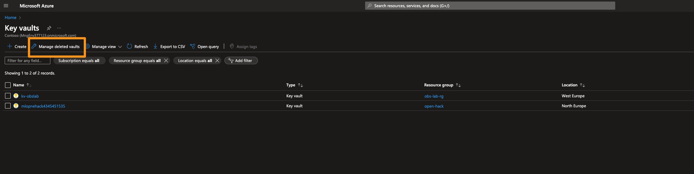

# Troubleshoot

## Infrastructure Deployment

### Cosmos DB

#### Capacity issues

When you see capacity issues, consider changing Azure regions specified in your `.env` file, to one of the larger ones like `eastus`, `eastus2` etc

### AKS Cluster

#### VM Size Unavailable

In case you see an error stating the selected VM size is unavailable, try selecting another one of the supported [VM sizes for AKS nodes](https://learn.microsoft.com/en-us/azure/aks/quotas-skus-regions#supported-vm-sizes) and change the value for [`agentVMSize`](https://github.com/observability-lab-cse/observability-lab/blob/main/infrastructure/k8s.bicep#L20) in the main file when calling the module [`./k8s.bicep`](https://github.com/observability-lab-cse/observability-lab/blob/00ddaa8fe5d5e464ab331873aca0a5eeb5db4050/infrastructure/main.bicep#L7).

### Key Vault

#### Re-deploy fail

Re-deployment fails due to a deleted Key Vault with the same name.

**Solution:** Purge or recover the old Key Vault

Go to portal as shown below:

